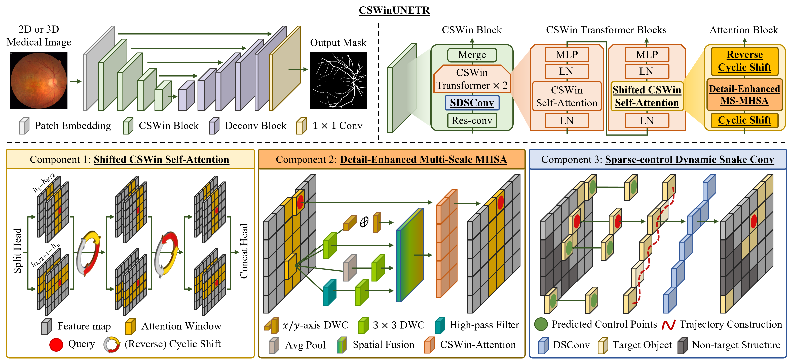

<h1 align="center">CSWinUNETR: Segmentation of Thin Anatomical Structures in Medical Images</h1>

<p align="center">
  <a href="https://scholar.google.com/citations?user=_mD5n_UAAAAJ"><strong>Junho Moon</strong></a>
  &nbsp;&middot;&nbsp;
  <a href="https://scholar.google.com/citations?user=O-oZnIwAAAAJ"><strong>Haejun Chung</strong></a>
  <span title="Corresponding author">&#9993;</span>
  &nbsp;&middot;&nbsp;
  <a href="https://scholar.google.com/citations?user=1rBh9xkAAAAJ"><strong>Ikbeom Jang</strong></a>
  <span title="Corresponding author">&#9993;</span>
  <br>
  <sub>&#9993; Corresponding authors</sub>
</p>

<p align="center">
  
</p>

Official repository for the paper:

> **[CSWinUNETR: Segmentation of Thin Anatomical Structures in Medical Images](https://arxiv.org/abs/2606.19824)**<br>
> MICCAI 2026<br>
> Junho Moon, Haejun Chung, Ikbeom Jang<br>
> ([arXiv ver](https://arxiv.org/abs/2606.19824))

## Overview

*Accurate segmentation of thin, tortuous anatomical structures, such as retinal vessels, cerebral vasculature, and facial wrinkles, remains challenging due to low contrast, frequent discontinuities, and severe class imbalance. Although recent convolutional and Transformer-based models have improved performance, they often yield fragmented predictions and fail to recover fine branches. We propose CSWinUNETR, a general-purpose backbone for 2D and 3D thin-structure segmentation. It employs cross-shaped stripe self-attention to model long-range principal-axis context and incorporates cyclic shifts to enhance information exchange across stripes. To better preserve fine-grained details, we further introduce a detail-enhanced multi-scale self-attention module that aggregates contextual features from multi-resolution representations. In addition, we propose sparse-control dynamic snake convolution, which reconstructs reliable dense curvilinear kernels from sparsely predicted control points to better follow tortuous geometry. Extensive experiments on four benchmarks across ophthalmology, neurovascular imaging, and dermatology demonstrate that CSWinUNETR consistently outperforms state-of-the-art methods without task-specific post-processing or topology-aware losses.*

## Code

Code will be updated and released soon.

## BibTex (to cite our paper)

If this work is useful for your research, please cite:

```bibtex
@article{moon2026cswinunetr,
  title={CSWinUNETR: Segmentation of Thin Anatomical Structures in Medical Images},
  author={Moon, Junho and Chung, Haejun and Jang, Ikbeom},
  journal={arXiv preprint arXiv:2606.19824},
  year={2026}
}
```

## Contact

For questions about the paper or repository, please open an issue or contact [**Junho Moon**](mailto:jhmoon6807@gmail.com).